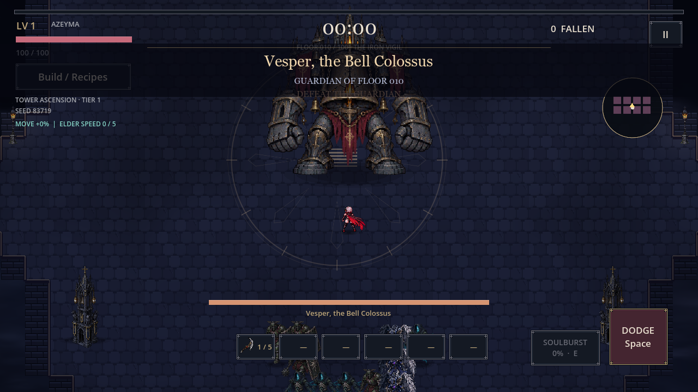

# GunnTrax

Projects by Michael Gunn, combining experience in HRIS and payroll systems with web and game development.

I'm based in Houston, Texas and available for remote contracts involving Paycom, HRIS support, implementation, data validation, reporting, and project work.

## GunnTrax web platform

GunnTrax is a contractor directory for local trades and remote freelancers. Its current development preview includes separate employer and contractor portals, job posting and search, contractor profiles, portfolio links, applications, and employer review.

The preview supports an end-to-end workflow: an employer posts a project, a contractor creates a profile and applies, and the employer reviews the application and portfolio.

**Project stack:** TypeScript, React, Vinext, Tailwind CSS, and Cloudflare Workers.

**Status:** Development preview. Access is restricted. Public registration and a production launch are not complete.

## Esper Shattered Sky

Esper: Shattered Sky is a Godot survival-action game project. The Windows development build follows Azeyma through a ruined world with automatic weapons, upgrades, permanent progression, and alternate endings.

The project includes:

- Player movement, dodging, combat, and character animation.
- Weapon and passive upgrade combinations.
- Tower progression, enemies, and guardian encounters.
- Save and resume systems.
- Development tools, test scripts, and release notes.

**Project stack:** Godot, GDScript, and Aseprite assets.

**Status:** Playable Windows development build. Mobile export presets are present; signed mobile releases and device testing are not complete.

## This portfolio

This repository contains the static GunnTrax portfolio page. Open `index.html` locally or publish the repository root with GitHub Pages. The page uses plain HTML and CSS and has no build dependencies.

Game and web-platform descriptions reflect development projects. The full game and platform source are maintained separately.

## HRIS and implementation experience

At Paycom, I supported configuration and client troubleshooting, validated payroll and benefits data, built MyReports and Report Center reports, worked with CSV imports and exports, tested configurations, and mentored specialists in quality review and implementation workflows.

## Contact

[LinkedIn](https://www.linkedin.com/in/michael-gunn-b00520275/) · [Email Michael](mailto:michael.gunn.careers@gmail.com)
